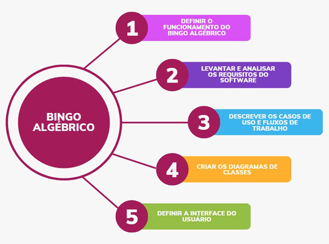
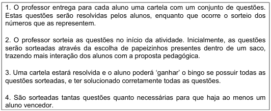
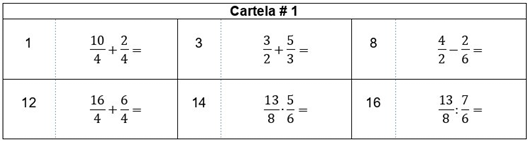
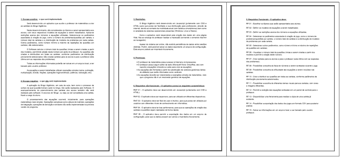
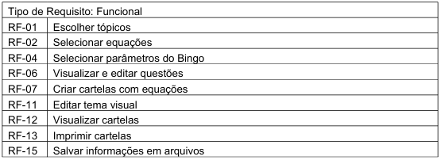
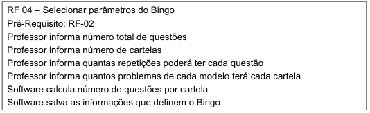
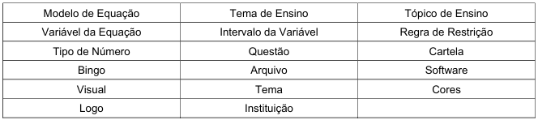
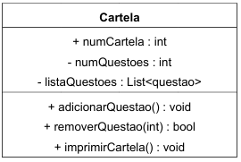
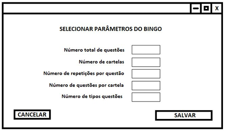

# Projeto de Software: Bingo Algébrico
Projeto desenvolvido por Romulo Rocha para a disciplina de Atividade Extensionista II – Tecnologia Aplicada à Inclusão Digital. Análise precidida na UNINTER, em parceria com a professora Alice Keiber.

## Objetivo

O Objetivo Geral do aplicativo Bingo Algébrico é possibilitar que professores criem fácil e 
rapidamente atividades de ensino com características lúdicas, possibilitando que o ensino 
de matemática seja facilitado, que resulte em aumento de interesse e desempenho por 
parte dos alunos. Temos como Objetivos Específicos para este projeto: 

- Prototipar e validar a interface de usuário para a realização do Bingo Algébrico 
- Implementar a lógica de funcionamento e elaboração do Bingo Algébrico,  
- Desenvolver o aplicativo Bingo Algébrico, projetado na Atividade Extensionista II 
- Obter feedback e atuar conforme sugestão de usuários do aplicativo 
- Documentar arquitetura do aplicativo para possíveis atualizações e manutenções

## Metodologia

Para a criação do projeto, foi feita uma entrevista em 12/08/2023 com a professora de
matemática Alice Keiber, discente na Escola Estadual de Ensino Médio Amadeo Rossi,
presente no município de São Leopoldo– Rio Grande do Sul. Neste momento foi
apresentada a proposta de realização de um projeto de desenvolvimento de software, e
discutimos alguns problemas e oportunidades presentes no cotidiano da professora.
Levantamos algumas possibilidade de projetos, escolhendo dar seguimento à ideia do
Bingo Algébrico, atividade lúdica já realizada pela professora de maneira analógica e
manual, porém sendo muito demorada e onerosa em sua elaboração

Foi proposto o sequenciamento de atividades, com cada uma referente a um Objetivo
Específico. Segue abaixo diagrama representando tal sequenciamento.

No período de 14/08/2023 à 01/09/2023, foi realizada uma revisão contextual sobre o uso
do Bingo Algébrico na sala de aula, a fim de entender o uso da ferramenta lúdica.
Preparou-se o rascunho do projeto, bem como revisou-se o material abordado nas
disciplinas do curso de Engenharia de Software em busca de um método de trabalho para
o desenvolvimento do projeto.

A seguir, no dia 16/09/2023 foi realizado o Levantamento Inicial através da apresentação
do rascunho de projeto à discente, bem como sua discussão. Buscou-se, com auxílio da
professora, a compreensão e validação do Objetivo Geral e dos Objetivos Específicos, a
fim de criar o Modelo de Proposta de Tema deste projeto.

O projeto foi submetido em 25/09/2023 e teve sua Validação de Proposta dada em
10/10/2023 por parte do corpo discente da UNINTER.

Um novo encontro foi realizado em 14/10/2023 para abordar o objetivo específico acerca
de Definir o Funcionamento do Bingo Algébrico. Conversou-se sobre o método de
funcionamento do jogo e como o software sendo projetado poderia auxiliar o usuário em
atingir o Objetivo Geral, relacionado a criação das questões matemáticas e cartelas de
bingo a serem utilizados na atividade lúdica.

Também foi redefinido que o desenvolvimento deste trabalho resultaria apenas no projeto
do software, que será futuramente implementado na disciplina de Atividade Extensionista
III– Tecnologia Aplicada à Inclusão Digital- Análise precidida na UNINTER. Assim, optou
se por eliminar o Objetivo Específico associado a Validação do Protótipo, o qual consegue
ser realizado apenas após a codificação do software. Uma pequena alteração foi
realizada na descrição do Objetivo Geral e no Titulo do projeto, para clarificar a intenção
de obter-se um Projeto do Software (e não o software em si)

Na semana de 16/10/2023 a 20/10/2023, foram desenvolvidos os requisitos específicos
do jogo. Foi definido o Escopo Positivo (o que será implementado) e o Escopo Negativo (o
que não será implementado), bem como foram observadas as Restrições presentes no
projeto. Para a ideação do fluxo de uso do software, assumiu-se algumas Premissas que
resultaram em uma listagem de Requisitos Funcionais (que descrevem as funcionalidades
a serem implementadas) e Requisitos Não-Funcionais (que descrevem características
presentes no software).

Ao término desta semana, o resultado deste estudo foi submetido à professora Alice para,
subsequentemente, discutirmos em reunião remota a relação entre todos os requisitos,
realizada no dia 21/10/2023 . Definimos quais requisitos seriam mantidos, quais requisitos
foram adicionados e quais deveriam ser descartados. Uma listagem final foi elaborada,
concluindo o objetivo específico de Levantar e Análisar os Requisitos de Software.

Na semana de 23/10/2023 a 29/10/2023, a partir das informações elicitadas, foram
desenvolvidos os Fluxos de Trabalho que o usuário do software irá realizar. Cada fluxo foi
estruturado como uma lista de passos a serem realizados pela professora ao utilizar o
aplicativo.

Ainda na mesma semana, foram definidas as Descrições dos Casos de Uso, visando
atender as etapas de cada fluxo. Ao término da semana, foram submetidos à professora
as definições desenvolvidas, tendo recebido retorno positivo sobre a resultado do objetivo
específico da Descrever os Casos de Uso e Fluxos de Trabalho.

A próxima etapa, realizada no período de 30/10/2023 à 03/11/2023, foi criação dos
Diagramas de Classes pertinentes ao projeto. Para tal, cada Caso de Uso foi examinado
em busca de substantivos que poderiam representar alguma entidade (objeto) a ter sua
informação modelada no software. Identificou-se quais propriedades cada objeto deveria
ter à partir das informações que seriam relacionadas a eles, e criou-se uma lista de
métodos obtida pela busca por verbos relacionados aos substantivos que descreviam
cada objeto. Com este resultado deu-se por atingido o objetivo específico de Criar os
Diagramas de Classes.

Oúltimo objetivo específico, redefinido como a Definir a Interface do Usuário, foi realizado
no período de 06/11/2023 à 19/11/2023, utilizando-se inicialmente uma tela para cada
Caso de Uso identificado. Nesta etapa, não foram considerados elementos de identifidade
visual do aplicativo, tais como cores e fontes, tendo sido criado apenas protótipos (telas)
de baixa fidelidade. O foco foi entender se todas as informações necessárias estão
mapeadas nas respectivas classes, e se o layout está atendendo a demanda de cada
Caso de Uso. Após a elaboração das telas, estas foram submetidas à professora Alice
para avaliação.

No dia 27/11/2023, foi realizada a elaboração e revisão do texto relacionado ao Trabalho
Final, para posterior submissão ao corpo discente da UNINTER, realizando assim o
Encerramento do Projeto.

A seguir temos o Cronograma realizado com a data de finalização de cada um dos
Objetivos Específicos propostos neste projeto.

## Resultados Obtidos

Em cada etapa, foram gerados alguns artefatos que representam o resultado de ter
finalizado cada Objetivo Específico. Temos a seguinte definição de funcionamento do
Bingo Algébrico, com exemplo de cartela a ser elaborada pelo software.

ApósLevantar eAnalisar osRequisitosdoSoftware, obtivemosoEscopoPositivo, o
EscopoNegativo, asRestriçõesdosoftware, asPremissasadotadasea listagemde
RequisitosFuncionaiseNãoFuncionais.

Coma Análise dos Requisitos de Software, determinou-se que haviamRequisitos
Funcionais que eram desnecessários e outros requisitos duplicados. Desta forma,
compactou-se a listagem gerando a listagem final à seguir. Os Requisitos Não-Funcionais
foram mantidos em sua totalidade.

Após descrever os Casos de Uso e Fluxos de Trabalho, tivemos uma lista de passos para cada
um dos requisitos acima mencionados. Segue a seguir exemplo de Caso de Uso.

Associado ao mesmo Caso de Uso, temos as seguintes Classes resultantes do Objetivo
Específico de Criar Diagramas de Classes.

Umexemplo de classe mapeada é a Cartela, dado seu diagrama abaixo.

Após Definir a Interface do Usuário, são criadas as telas para cada fluxo de trabalho que o
professor realizará. Segue abaixo exemplo de tela para a tela relacionada ao Requisito
Funcional 04 (selecionar parâmetros do bingo).

## Considerações Finais

Foi desenvolvido o projeto de um software para auxiliar os professores de matemática a
criarem o Bingo Algébrico, atividade de ensino lúdica que promove a Educação de
Qualidade, conforme um dos Objetivos de Desenvolvimento Sustentável (ODS) propostos
pelas Organização das Nações Unidas. O Objetivo Geral deste projeto foi atendido,
mesmo considerando a pivotagem realizada em relação à remoção do objetivo específico
de Elaboração de um Protótipo, melhor associado à etapa de codificação do software.

Durante o desenvolvimento das atividades, foi observada a complexidade associada ao
desenvolvimento da documentação de um software sendo projetado. A grande quantidade
de metodologias de desenvolvimento de projetos trazem poucas informações específicas
acerca dos artefatos de um projeto, sendo necessário uma constante comunicação com
as Partes Interessadas para garantir que o escopo esteja adequado ao Objetivo do
Projeto. Neste aspecto, os Principios do Manifesto Ágil guiam o desenvolvimento, porém
sem abordar diretamente o problema da documentação.

Sendo este o primeiro projeto de software realizado pelo autor, foi observado ao seu
término a ausência de aspectos de arquitetura de software, usualmente definidos no início
da etapa de desenvolvimento e codificação. Ao passo que esta característica permite a
implementação do projeto de diversas maneiras, tal arquitetura poderia afetar as
propriedades e métodos associados a cada classe mapeada, resultando em um risco de
retrabalho associado a adequação ao framework de desenvolvimento selecionado.

O aspecto mais desafiador esteve relacionado ao Objetivo Específico de Definição da
Interface do Usuário. Acredito que a obtenção de conhecimentos relacionados ao Design
Visual é recomendada para que haja resultados mais satisfatórios na elaboração das
telas, e que assim possa trazer mais riqueza de conteúdo ao projeto.

Contudo, o desenvolvimento de software não finaliza na entrega do produto projetado
e/ou codificado. É possível aprimorar o visual e os recursos do projeto do Bingo Algébrico
à medida que for iniciado seu uso por parte de professores de matemática, criando um
ciclo de otimização contínua. Deste modo, é mais valorizado termos um software
funcionando, capaz de responder as mudanças propostas pela colaboração com os
clientes, através de frequentes interações entre os usuários e desenvolvedores.
