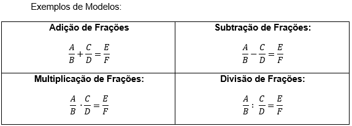
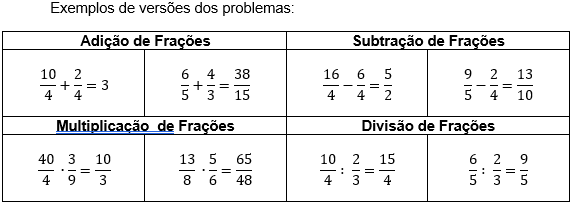

# Definição do Bingo Algébrico

## 1. O professor define os tópicos que serão incluídos nas questões do bingo algébrico:
Exemplo de tópicos selecionados:
- Operações de Adição de Frações
- Operações de Subtração de Frações
- Operações de Multiplicação de Frações
- Operações de Divisão de Frações

## 2. Para cada tópico, o professor define um modelo de problema a ser resolvido pelo aluno.
Exemplos de Modelos:

## 3. Para cada modelo de problema, o professor cria regras de restrições sobre o problema
Exemplo de Restrição:
- A, B, C, D, E e F são números inteiros
- Manter todos números entre 1 e 99, preferencialmente menores que 10
- Se o resultado ‘E / F’ for número inteiro, apresentar versão simplificada
  - Exemplo 1: [10/2 = 5] logo apresenta apenas o número 5
  - Exemplo 2: [10/6 =  5/3] logo apenas simplifica a fração
- Se possível, não repetir os valores para cada variável

## 4. O professor define o número de problemas por cartela. Define também o número total de cartelas, e a distribuição de modelos de problemas por cada cartela.
Exemplo: 6 problemas por cartela, incluindo os quatro tópicos, para um total de 20 cartelas. A distribuição de cada tópico em cartela é:
- No mínimo 2 Problemas de Adição de Frações
- No mínimo 1 Problema de Subtração de Frações
- No mínimo 1 Problema de Multiplicação de Frações
- No mínimo 1 Problema de Divisão de Frações

## 5. O professor define o número mínimo e máximo de vezes que cada problema pode repetir em cartelas distintas, considerando o número total de questões (número de cartelas x número de problemas por cartela), e também considerando a distribuição dos problemas.
Exemplo: 6 problemas por cartela, com 20 cartelas são 120 problemas (considerando repetições). Cada questão pode estar no mínimo em 5 e no máximo em 10 cartelas. Logo, o número de problemas para cada modelo de problema pode ser (com repetições):
- 42 Problemas de Adição de Frações
- 26 Problema de Subtração de Frações
- 26 Problema de Multiplicação de Frações
- 26 Problema de Divisão de Frações

## 6. Com o número total de problemas por tópico, o número de repetições em cartelas definido, e o total de problemas que devem existir, é obtido o número de questões únicas para cada tópico de problema (de [número de problemas / máximo por cartela] até [número de problemas / minimo por cartela]):
- De 5 a 9 Problemas de Adição de Frações		-> Escolhe-se 8
- De 3 a 5 Problema de Subtração de Frações	-> Escolhe-se 4
- De 3 a 5 Problema de Multiplicação de Frações	-> Escolhe-se 4
- De 3 a 5 Problema de Divisão de Frações		-> Escolhe-se 4
- Total de 20 questões únicas.

## 7. O professor cria um conjunto de problemas com tantas questões únicas para cada tópico conforme acima descrito, para cada modelo de problema.

## 8. O professor distribui as questões para cada cartela de acordo com a distribuição de questões a serem criadas. Cada questão recebe um número que a represente no bingo. Toma-se o cuidado de não informar a resposta do problema ao aluno.

## 9. Funcionamento do Bingo Algébrico
1. O professor entrega para cada aluno uma cartela com um conjunto de questões. Estas questões serão resolvidas pelos alunos, enquanto que ocorre o sorteio dos números que as representem.

2. O professor sorteia as questões no início da atividade. Inicialmente, as questões serão sorteadas através da escolha de papeizinhos presentes dentro de um saco, trazendo mais interação dos alunos com a proposta pedagógica.

3. Uma cartela estará resolvida e o aluno poderá ‘ganhar’ o bingo se possuir todas as questões sorteadas, e ter solucionado corretamente todas as questões.

4. São sorteadas tantas questões quanto necessárias para que haja ao menos um aluno vencedor.
